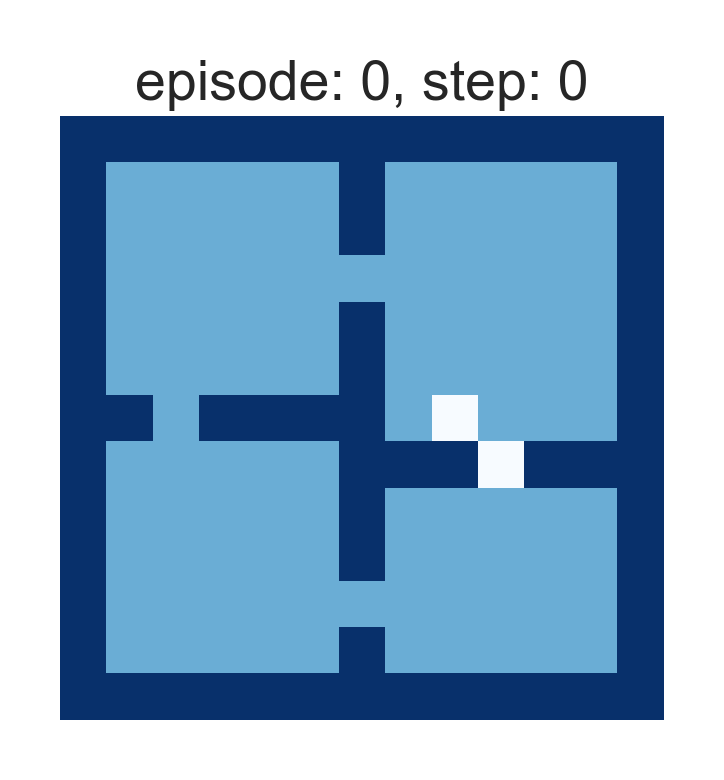

# The Option-Critic Architecture

Implementation of the [Option-Critic Architecture](https://arxiv.org/abs/1609.05140)
on a notebook. The implementation is based on the 
[original implementation](https://github.com/jeanharb/option_critic) of the authors.

**Dependencies:** numpy, scipy, matplotlib

Below is the trained agent:

    

See also the related [blog post](https://alversafa.github.io/blog/2018/11/28/optncrtc.html)
of mine.

PyTorch implementation on ATARI is coming soon.
